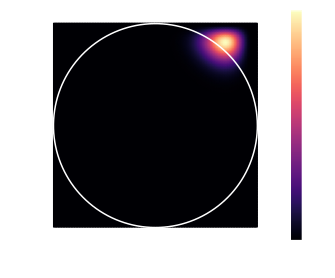
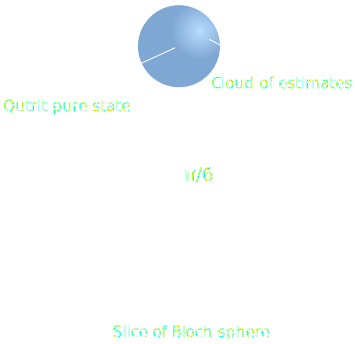

  

  <h1>Rank deficiency and the Euclidean geometry of quantum states</h1>

  
Jonathan A. Gross and Carlton M. Caves

  
University of New Mexico, Center for Quantum Information and Control

  

  <h2>Rank deficiency</h2>

  
The number of parameters required to characterize an arbitrary state of a
  <math xmlns="http://www.w3.org/1998/Math/MathML"> <mi>d</mi>
  </math>-dimensional quantum system quickly grows to intractable levels:

<math xmlns="http://www.w3.org/1998/Math/MathML" display="block"> <mtable
columnalign="right left right left right left right left right left right left"
rowspacing="3pt" columnspacing="0em 2em 0em 2em 0em 2em 0em 2em 0em 2em 0em"
displaystyle="true"> <mtr> <mtd> <mtext>Parameters</mtext> </mtd> <mtd>
<mi></mi> <mo>=</mo> <msup> <mi>d</mi> <mn>2</mn> </msup> <mo>&#x2212;<!-- −
--></mo> <mn>1</mn> <mspace width="thinmathspace" /> <mo>.</mo> </mtd> </mtr>
</mtable> </math>

  
If there is good reason to believe that the system is well described by a
  state of bounded rank <math
  xmlns="http://www.w3.org/1998/Math/MathML"> <mi>r</mi> </math>, then the
  number of parameters required to describe the state only scales linearly in
  the Hilbert-space dimension:

<math xmlns="http://www.w3.org/1998/Math/MathML" display="block"> <mtable
columnalign="right left right left right left right left right left right left"
rowspacing="3pt" columnspacing="0em 2em 0em 2em 0em 2em 0em 2em 0em 2em 0em"
displaystyle="true"> <mtr> <mtd> <mtext>Parameters</mtext> </mtd> <mtd>
<mi></mi> <mo>=</mo> <mi>r</mi> <mspace width="thinmathspace" /> <mo
stretchy="false">(</mo> <mn>2</mn> <mi>d</mi> <mo>&#x2212;<!-- − --></mo>
<mi>r</mi> <mo stretchy="false">)</mo> <mo>&#x2212;<!-- − --></mo> <mn>1</mn>
<mspace width="thinmathspace" /> <mo>.</mo> </mtd> </mtr> </mtable> </math>

  
The <q>efficient</q> parametrization of bounded-rank states causes us to
  be interested in estimators that tend to return rank-deficient states, such
  as the maximum-likelihood estimator (MLE).

  <h2>Maximum-likelihood estimation</h2>

  
The maximum-likelihood estimate for the quantum state is the density
  matrix that assigns the highest probability for obtaining the data:

<math xmlns="http://www.w3.org/1998/Math/MathML" display="block"> <mtable
columnalign="right left right left right left right left right left right left"
rowspacing="3pt" columnspacing="0em 2em 0em 2em 0em 2em 0em 2em 0em 2em 0em"
displaystyle="true"> <mtr> <mtd> <mrow class="MJX-TeXAtom-ORD"> <mi
class="MJX-tex-caligraphic" mathvariant="script">L</mi> </mrow> <mrow>
<mo>(</mo> <mi>&#x03C1;<!-- ρ --></mi> <mspace width="thinmathspace" />
<mo>|</mo> <mspace width="thinmathspace" /> <mtext>data</mtext> <mo>)</mo>
</mrow> </mtd> <mtd> <mi></mi> <mo>:=</mo> <mi>Pr</mi> <mrow> <mo>(</mo>
<mtext>data</mtext> <mspace width="thinmathspace" /> <mo>|</mo> <mspace
width="thinmathspace" /> <mi>&#x03C1;<!-- ρ --></mi> <mo>)</mo> </mrow> </mtd>
</mtr> <mtr> <mtd> <msub> <mrow class="MJX-TeXAtom-ORD"> <mover>
<mi>&#x03C1;<!-- ρ --></mi> <mo stretchy="false">&#x005E;<!-- ^ --></mo>
</mover> </mrow> <mrow class="MJX-TeXAtom-ORD"> <mtext>MLE</mtext> </mrow>
</msub> <mo stretchy="false">(</mo> <mtext>data</mtext> <mo
stretchy="false">)</mo> </mtd> <mtd> <mi></mi> <mspace width="mediummathspace"
/> <mo>=</mo> <munder> <mrow class="MJX-TeXAtom-OP"> <mi
mathvariant="normal">a</mi> <mi mathvariant="normal">r</mi> <mi
mathvariant="normal">g</mi> <mspace width="thinmathspace" /> <mi
mathvariant="normal">m</mi> <mi mathvariant="normal">a</mi> <mi
mathvariant="normal">x</mi> </mrow> <mrow class="MJX-TeXAtom-ORD">
<mi>&#x03C1;<!-- ρ --></mi> <mo>&#x2265;<!-- ≥ --></mo> <mn>0</mn> <mo>,</mo>
<mspace width="thinmathspace" /> <mi>tr</mi> <mo>&#x2061;<!-- ⁡ --></mo> <mo
stretchy="false">[</mo> <mi>&#x03C1;<!-- ρ --></mi> <mo stretchy="false">]</mo>
<mo>=</mo> <mn>1</mn> </mrow> </munder> <mspace width="thinmathspace" /> <mrow
class="MJX-TeXAtom-ORD"> <mi class="MJX-tex-caligraphic"
mathvariant="script">L</mi> </mrow> <mrow> <mo>(</mo> <mi>&#x03C1;<!-- ρ
--></mi> <mspace width="thinmathspace" /> <mo>|</mo> <mspace
width="thinmathspace" /> <mtext>data</mtext> <mo>)</mo> </mrow> <mspace
width="thinmathspace" /> <mo>.</mo> </mtd> </mtr> </mtable> </math>

  
In the absence of boundaries to constrain the estimate, the
  maximum-likelihood estimator is asymptotically normal. For quantum state
  estimation, the only boundaries in the problem are those imposed by the
  positivity constraint, so it is sometimes convenient to perform an
  unconstrained maximum-likelihood estimate:

<math xmlns="http://www.w3.org/1998/Math/MathML" display="block"> <mtable
columnalign="right left right left right left right left right left right left"
rowspacing="3pt" columnspacing="0em 2em 0em 2em 0em 2em 0em 2em 0em 2em 0em"
displaystyle="true"> <mtr> <mtd> <msub> <mrow class="MJX-TeXAtom-ORD"> <mover>
<mi>A</mi> <mo stretchy="false">&#x005E;<!-- ^ --></mo> </mover> </mrow> <mrow
class="MJX-TeXAtom-ORD"> <mtext>MLE</mtext> </mrow> </msub> <mo
stretchy="false">(</mo> <mtext>data</mtext> <mo stretchy="false">)</mo> </mtd>
<mtd> <mi></mi> <mspace width="mediummathspace" /> <mo>=</mo> <munder> <mrow
class="MJX-TeXAtom-OP"> <mi mathvariant="normal">a</mi> <mi
mathvariant="normal">r</mi> <mi mathvariant="normal">g</mi> <mspace
width="thinmathspace" /> <mi mathvariant="normal">m</mi> <mi
mathvariant="normal">a</mi> <mi mathvariant="normal">x</mi> </mrow> <mrow
class="MJX-TeXAtom-ORD"> <mi>tr</mi> <mo>&#x2061;<!-- ⁡ --></mo> <mo
stretchy="false">[</mo> <mi>A</mi> <mo stretchy="false">]</mo> <mo>=</mo>
<mn>1</mn> </mrow> </munder> <mspace width="thinmathspace" /> <mrow
class="MJX-TeXAtom-ORD"> <mi class="MJX-tex-caligraphic"
mathvariant="script">L</mi> </mrow> <mrow> <mo>(</mo> <mi>A</mi> <mspace
width="thinmathspace" /> <mo>|</mo> <mspace width="thinmathspace" />
<mtext>data</mtext> <mo>)</mo> </mrow> <mspace width="thinmathspace" />
<mo>.</mo> </mtd> </mtr> </mtable> </math>

<figure>
  
  <figcaption>Scatter plots of maximum-likelihood estimates for two different
  <q>true</q> states upon which random Pauli <math
  xmlns="http://www.w3.org/1998/Math/MathML"> <mi>X</mi> </math> and <math
  xmlns="http://www.w3.org/1998/Math/MathML"> <mi>Z</mi> </math> measurements
  were performed. Covariance ellipses illustrate the variation of the
  classical Fisher information within the state space (see bottom panel for
  more details).</figcaption>
</figure>

  
Unconstrained estimate lying outside the set of positive states result in
  constrained estimates lying on the boundary of the state space due to the
  convex structure of this problem.

<figure>
  
  <figcaption>Likelihood functions with the maximum outside the state space
  reach their maximum value within the state space along the
  boundary.</figcaption>
</figure>

  <h2>State-space geometry</h2>

  
States on the boundary are rank deficient, and therefore offer some amount
  of parameter reduction. To partially characterize the rank-deficient behavior
  of maximum-likelihood estimates, we wish to calculate the probability of
  obtaining a rank-deficient estimate given a pure (rank-1) <q>true</q>
  state. Our initial calculations depend on some na&iuml;ve assumptions
  discussed in the panel below.

<figure>
  
  <figcaption>The probability of obtaining a full-rank estimate has a
  geometric interpretation as the solid angle of a cone whose base is the
  state space for a quantum system of one lower Hilbert-space
  dimension.</figcaption>
</figure>

<figure>
  
  <figcaption>The solid angles of the relevant cones fall precipitously as
  the Hilbert-space dimension grows.</figcaption>
</figure>

  <h2>Related Work</h2>

  
For a related geometric approach to model selection, see the poster <em>An
  effective state-space dimension for a quantum system</em> by Travis
  Scholten.

  <h2>Classical Fisher metric</h2>

  
The solid-angles in the top panel were calculated assuming an isotropic
  covariance for the maximum-likelihood estimates relative to the
  Hilbert&ndash;Schmidt metric:

<math xmlns="http://www.w3.org/1998/Math/MathML" display="block"> <mtable
columnalign="right left right left right left right left right left right left"
rowspacing="3pt" columnspacing="0em 2em 0em 2em 0em 2em 0em 2em 0em 2em 0em"
displaystyle="true"> <mtr> <mtd> <msub> <mrow> <mo>&#x2225;</mo> <msub>
<mi>&#x03C1;<!-- ρ --></mi> <mn>1</mn> </msub> <mo>&#x2212;<!-- − --></mo>
<msub> <mi>&#x03C1;<!-- ρ --></mi> <mn>2</mn> </msub> <mo>&#x2225;</mo> </mrow>
<mrow class="MJX-TeXAtom-ORD"> <mtext>HS</mtext> </mrow> </msub> </mtd> <mtd>
<mi></mi> <mo>=</mo> <msqrt> <mi>tr</mi> <mrow> <mo>[</mo> <msup> <mrow>
<mo>(</mo> <msub> <mi>&#x03C1;<!-- ρ --></mi> <mn>1</mn> </msub>
<mo>&#x2212;<!-- − --></mo> <msub> <mi>&#x03C1;<!-- ρ --></mi> <mn>2</mn>
</msub> <mo>)</mo> </mrow> <mn>2</mn> </msup> <mo>]</mo> </mrow> </msqrt>
<mspace width="thinmathspace" /> <mo>.</mo> </mtd> </mtr> </mtable> </math>

  
In general, the covariance of the maximum-likelihood estimates is
  expressed as the classical Fisher information <math
  xmlns="http://www.w3.org/1998/Math/MathML"> <mi>C</mi> </math> for the
  measurement <math xmlns="http://www.w3.org/1998/Math/MathML"> <mo
  fence="false" stretchy="false">{</mo> <msup> <mi>E</mi> <mi>&#x03BE;<!-- ξ
  --></mi> </msup> <msub> <mo fence="false" stretchy="false">}</mo>
  <mi>&#x03BE;<!-- ξ --></mi> </msub> </math> being performed, evaluated at the
  <q>true</q> state <math xmlns="http://www.w3.org/1998/Math/MathML">
  <mi>&#x03C1;<!-- ρ --></mi> </math>:

<math xmlns="http://www.w3.org/1998/Math/MathML" display="block"> <mtable
columnalign="right left right left right left right left right left right left"
rowspacing="3pt" columnspacing="0em 2em 0em 2em 0em 2em 0em 2em 0em 2em 0em"
displaystyle="true"> <mtr> <mtd> <mi>&#x03C1;<!-- ρ --></mi> </mtd> <mtd>
<mi></mi> <mo>=</mo> <mfrac> <mn>1</mn> <mi>d</mi> </mfrac> <mi>I</mi>
<mo>+</mo> <msup> <mi>x</mi> <mi>&#x03B1;<!-- α --></mi> </msup> <msub>
<mi>X</mi> <mi>&#x03B1;<!-- α --></mi> </msub> </mtd> </mtr> <mtr> <mtd> <msub>
<mi>C</mi> <mrow class="MJX-TeXAtom-ORD"> <mi>&#x03B1;<!-- α --></mi>
<mi>&#x03B2;<!-- β --></mi> </mrow> </msub> </mtd> <mtd> <mi></mi> <mo>=</mo>
<munder> <mo>&#x2211;<!-- ∑ --></mo> <mi>&#x03BE;<!-- ξ --></mi> </munder>
<mfrac> <mrow> <mi>tr</mi> <mo>&#x2061;<!-- ⁡ --></mo> <mo
stretchy="false">[</mo> <msup> <mi>E</mi> <mi>&#x03BE;<!-- ξ --></mi> </msup>
<msub> <mi>X</mi> <mi>&#x03B1;<!-- α --></mi> </msub> <mo
stretchy="false">]</mo> <mi>tr</mi> <mo>&#x2061;<!-- ⁡ --></mo> <mo
stretchy="false">[</mo> <msup> <mi>E</mi> <mi>&#x03BE;<!-- ξ --></mi> </msup>
<msub> <mi>X</mi> <mi>&#x03B2;<!-- β --></mi> </msub> <mo
stretchy="false">]</mo> </mrow> <mrow> <mi>tr</mi> <mo>&#x2061;<!-- ⁡ --></mo>
<mo stretchy="false">[</mo> <msup> <mi>E</mi> <mi>&#x03BE;<!-- ξ --></mi>
</msup> <mi>&#x03C1;<!-- ρ --></mi> <mo stretchy="false">]</mo> </mrow>
</mfrac> </mtd> </mtr> <mtr> <mtd> <mi>Cov</mi> <mrow> <mo>(</mo> <msup> <mrow
class="MJX-TeXAtom-ORD"> <mover> <mi>x</mi> <mo stretchy="false">&#x005E;<!-- ^
--></mo> </mover> </mrow> <mi>&#x03B1;<!-- α --></mi> </msup> <mo>,</mo> <msup>
<mrow class="MJX-TeXAtom-ORD"> <mover> <mi>x</mi> <mo
stretchy="false">&#x005E;<!-- ^ --></mo> </mover> </mrow> <mi>&#x03B2;<!-- β
--></mi> </msup> <mo>)</mo> </mrow> </mtd> <mtd> <mi></mi> <mo>&#x223C;<!-- ∼
--></mo> <msub> <mrow> <mo>[</mo> <msup> <mi>C</mi> <mrow
class="MJX-TeXAtom-ORD"> <mo>&#x2212;<!-- − --></mo> <mn>1</mn> </mrow> </msup>
<mo>]</mo> </mrow> <mrow class="MJX-TeXAtom-ORD"> <mi>&#x03B1;<!-- α --></mi>
<mi>&#x03B2;<!-- β --></mi> </mrow> </msub> <mspace width="thinmathspace" />
<mo>.</mo> </mtd> </mtr> </mtable> </math>

<figure>
  
  <figcaption>Comparison between the Hilbert&ndash;Schmidt metric and the
  classical Fisher metric for Pauli measurements on a rebit. The grid lines
  on the classical-Fisher diagram form squares where the metric is
  proportional to the Hilbert&ndash;Schmidt metric.</figcaption>
</figure>

  
The figure above illustrates just how wildly the classical Fisher
  information, interpreted as a metric, can deviate from the
  Hilbert&ndash;Schmidt metric. Even for the simple case of a rebit, isotropy
  is only present along the diagonals.

  <h2>Higher dimensions</h2>

  
The classical Fisher metric has even more interesting behavior in Hilbert
  spaces of dimension 3 or higher. This behavior is made evident when
  considering the classical Fisher metric as a superoperator:

<math xmlns="http://www.w3.org/1998/Math/MathML" display="block"> <mtable
columnalign="right left right left right left right left right left right left"
rowspacing="3pt" columnspacing="0em 2em 0em 2em 0em 2em 0em 2em 0em 2em 0em"
displaystyle="true"> <mtr> <mtd> <mrow class="MJX-TeXAtom-ORD"> <mi
class="MJX-tex-caligraphic" mathvariant="script">C</mi> </mrow> <mo
stretchy="false">(</mo> <mo>&#x2299;<!-- ⊙ --></mo> <mo stretchy="false">)</mo>
</mtd> <mtd> <mi></mi> <mo>=</mo> <munder> <mo>&#x2211;<!-- ∑ --></mo>
<mi>&#x03BE;<!-- ξ --></mi> </munder> <mfrac> <mrow> <msup> <mi>E</mi>
<mi>&#x03BE;<!-- ξ --></mi> </msup> <mo>&#x2299;<!-- ⊙ --></mo> <msup>
<mi>E</mi> <mi>&#x03BE;<!-- ξ --></mi> </msup> </mrow> <mrow> <mi>tr</mi>
<mo>&#x2061;<!-- ⁡ --></mo> <mo stretchy="false">[</mo> <msup> <mi>E</mi>
<mi>&#x03BE;<!-- ξ --></mi> </msup> <mi>&#x03C1;<!-- ρ --></mi> <mo
stretchy="false">]</mo> </mrow> </mfrac> <mspace width="thinmathspace" />
<mo>.</mo> </mtd> </mtr> </mtable> </math>

  
There is a certain involution on superoperators, denoted here by # (sharp),
  defined by

<math xmlns="http://www.w3.org/1998/Math/MathML" display="block"> <mtable
columnalign="right left right left right left right left right left right left"
rowspacing="3pt" columnspacing="0em 2em 0em 2em 0em 2em 0em 2em 0em 2em 0em"
displaystyle="true"> <mtr> <mtd> <mrow class="MJX-TeXAtom-ORD"> <mi
class="MJX-tex-caligraphic" mathvariant="script">A</mi> </mrow> </mtd> <mtd>
<mi></mi> <mo>:</mo> <mi>B</mi> <mo stretchy="false">&#x21A6;<!-- ↦ --></mo>
<munder> <mo>&#x2211;<!-- ∑ --></mo> <mi>&#x03BE;<!-- ξ --></mi> </munder>
<msup> <mi>L</mi> <mi>&#x03BE;<!-- ξ --></mi> </msup> <mi>B</mi> <msup>
<mi>R</mi> <mi>&#x03BE;<!-- ξ --></mi> </msup> </mtd> </mtr> <mtr> <mtd> <msup>
<mrow class="MJX-TeXAtom-ORD"> <mi class="MJX-tex-caligraphic"
mathvariant="script">A</mi> </mrow> <mi mathvariant="normal">&#x266F;<!-- ♯
--></mi> </msup> </mtd> <mtd> <mi></mi> <mo>:</mo> <mi>B</mi> <mo
stretchy="false">&#x21A6;<!-- ↦ --></mo> <munder> <mo>&#x2211;<!-- ∑ --></mo>
<mi>&#x03BE;<!-- ξ --></mi> </munder> <mi>tr</mi> <mo>&#x2061;<!-- ⁡ --></mo>
<mo stretchy="false">[</mo> <msup> <mi>R</mi> <mi>&#x03BE;<!-- ξ --></mi>
</msup> <mi>B</mi> <mo stretchy="false">]</mo> <msup> <mi>L</mi>
<mi>&#x03BE;<!-- ξ --></mi> </msup> <mspace width="thinmathspace" /> <mo>.</mo>
</mtd> </mtr> </mtable> </math>

<figure>
  
  <figcaption>The # involution represented via a tensor diagram. The exchange
  of wires corresponds to swapping two indices of a rank-4
  tensor.</figcaption>
</figure>

  
If <math xmlns="http://www.w3.org/1998/Math/MathML"> <mo fence="false"
  stretchy="false">{</mo> <msup> <mi>E</mi> <mi>&#x03BE;<!-- ξ --></mi> </msup>
  <msub> <mo fence="false" stretchy="false">}</mo> <mi>&#x03BE;<!-- ξ --></mi>
  </msub> </math> is composed entirely of rank-1 operators (a <q>lossless</q>
  POVM), the superoperator <math xmlns="http://www.w3.org/1998/Math/MathML">
  <mrow class="MJX-TeXAtom-ORD"> <mi class="MJX-tex-caligraphic"
  mathvariant="script">C</mi> </mrow> </math> is invariant under sharping. This
  seemingly esoteric observation has interesting consequences, as many widely
  used metrics (including the Hilbert&ndash;Schmidt metric) have associated
  superoperators that are <em>not</em> sharp invariant for Hilbert spaces of
  dimension 3 or higher. For this reason, the isotropic assumption will
  <em>never</em> be valid for rank-1 measurements.

  <h2>Further inquiry</h2>

  
Isotropy of the classical Fisher information is a common assumption (see
  [1], for example). It remains to be seen how misleading this assumption is in
  practice.

  
Noisy measurements (for which the POVM contains higher-rank operators) do
  not generally yield sharp-invariant superoperators. Is it possible for such a
  measurement to produce an isotropic classical Fisher information, and if so
  how noisy must it be?

  <h2>References</h2>

  <cite>[1] <em>Efficient Method for Computing the Maximum-Likelihood Quantum
  State from Measurements with Additive Gaussian Noise</em>, John A. Smolin,
  Jay M. Gambetta, and Graeme Smith.
  <a href="https://doi.org/10.1103/PhysRevLett.108.070502">Phys Rev. Lett.
  <strong>108</strong>, 070502</a> &ndash; Published 17 February 2017</cite>

